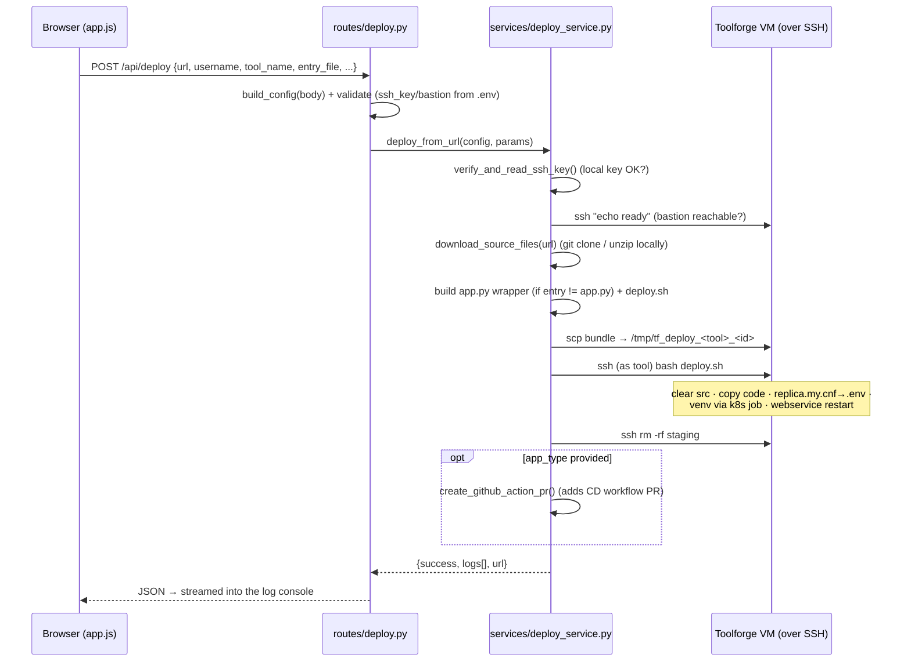

# Deployr — Architecture & Function Reference

> One-click deployment platform for **Wikimedia Toolforge**. Paste (or pick) a
> repository, hit **Deploy**, and Deployr SSHes into the tool's Toolforge VM,
> ships the code, wires up the database credentials, builds the virtualenv, and
> (re)starts the webservice — all driven from a Codex-styled web dashboard.

---

## 1. The plan (what this is and why)

Deploying a tool to Toolforge by hand means: SSH to the bastion → `become <tool>`
→ pull code → build a venv (via a Kubernetes job on modern Toolforge) → restart the
webservice. Every maintainer repeats this. **Deployr turns that into a button.**

- **Frontend** (`frontend/`) — a no-build dashboard. Lists deployable tools, lets
  you add one by pasting a repo URL, and exposes Deploy / Start / Stop / Restart /
  Status per tool, with a live log console.
- **Backend** (`app.py` + `routes/` + `services/`) — a Flask API that does the real
  work over SSH/SCP against the Toolforge bastion (`login.toolforge.org`). It is
  **stateless about connection config**: per-request, user-specific values
  (`username`, `tool_name`) arrive in the request body, while host/secret values
  (`TOOLFORGE_SSH_KEY`, `TOOLFORGE_BASTION_HOST`) are read from the environment
  (`.env`). There is no server-side config file.
- **Catalogue DB** (`db.py`, MariaDB/MySQL) — stores the list of tools ("which repos
  can I deploy"), so the catalogue is persistent and editable, not hardcoded.
- **CD bootstrap** (`github_pr_creator.py` + `*_cd.yml`) — optionally opens a PR on the
  target repo adding a GitHub Actions workflow, so future pushes auto-deploy.

Two separate databases are involved — don't confuse them:

|                                                    | Purpose                                                 | Where                                                             |
| -------------------------------------------------- | ------------------------------------------------------- | ----------------------------------------------------------------- |
| **Deployr catalogue DB** (`deployr.tools`) | Deployr's own list of deployable tools                  | Local MariaDB/MySQL (`db.py`)                                   |
| **A tool's ToolsDB**                         | The deployed app's own data, creds in`replica.my.cnf` | On the tool's Toolforge VM, wired into its`.env` at deploy time |

---

## 2. Architecture at a glance

```
┌──────────────────────────────┐         ┌──────────────────────────────────────┐
│  Browser (frontend/)         │  HTTP   │  Flask backend (app.py)                │
│  index.html · app.js · CSS   │ ──────► │  ┌─────────── routes/ ─────────────┐   │
│  - lists tools               │  /api/* │  │ tools.py    config.py           │   │
│  - Deploy / Start / Stop     │ ◄────── │  │ deploy.py   webservice.py       │   │
│  - live log console          │  JSON   │  └─────────────┬───────────────────┘   │
└──────────────────────────────┘         │   ┌────────────┴── services/ ──────┐   │
                                          │   │ deploy_service  ssh_service    │   │
        ┌─────────────────────┐           │   │ config_service  download_svc   │   │
        │ deployr.tools (DB)  │◄──────────┤   └────────────┬───────────────────┘   │
        │ MariaDB / MySQL     │  db.py    │                │ ssh / scp              │
        └─────────────────────┘           └────────────────┼───────────────────────┘
                                                            ▼
                                          ┌──────────────────────────────────────┐
                                          │  Toolforge bastion → tool VM          │
                                          │  /data/project/<tool>/www/python/src  │
                                          │  replica.my.cnf → .env · venv · k8s   │
                                          └──────────────────────────────────────┘
```

---

## 3. Project layout

```
toolforge_toolkit/
├── app.py                      # Flask entry point: registers blueprints, serves the UI
├── db.py                       # Catalogue DB layer (schema, seed, CRUD, URL parsing)
├── github_pr_creator.py        # Opens a CD-workflow PR on the target repo
├── flask_cd.yml / node_cd.yml  # GitHub Actions CD templates copied into target repos
├── requirements.txt            # flask, PyMySQL, python-dotenv
├── .env.example                # template for TOOLFORGE_* + DEPLOYR_DB_* + GITHUB_TOKEN
├── routes/                     # HTTP layer (thin Flask blueprints)
│   ├── tools.py                #   /api/tools*       (catalogue CRUD + inspect)
│   ├── config.py               #   /api/test-connection
│   ├── deploy.py               #   /api/deploy
│   └── webservice.py           #   /api/webservice/*
├── services/                   # Business logic (no Flask imports)
│   ├── deploy_service.py       #   the end-to-end deploy pipeline
│   ├── ssh_service.py          #   ssh/scp command construction + execution
│   ├── config_service.py       #   build/validate config from body + env, key check
│   └── download_service.py     #   git clone / archive download + extract
└── frontend/                   # Dashboard (vanilla HTML/CSS/JS, no build step)
    ├── index.html · styles.css · app.js
    └── data.js                 # offline fallback catalogue
```

---

## 4. The deploy flow, end to end

What happens when you click **Deploy** on a card:



The remote `deploy.sh` (generated in `deploy_service.py`) runs **as the tool user** and:

1. Clears & recreates `~/www/python/src`, copies the new code in.
2. **Reads `~/replica.my.cnf` and writes DB creds into `~/www/python/src/.env`**
   (`DB_USER`, `DB_PASSWORD`, `DB_HOST`, `DB_PORT`, `DB_SSL_DISABLED`) — creates the
   file if missing, appends if present, idempotent on redeploy.
3. If `requirements.txt` exists, builds a fresh venv via a one-off **Toolforge
   Kubernetes job** with the matching Python image.
4. `toolforge webservice <py> restart || start`.

---

## 5. Backend function reference

### `app.py`

| Function       | Does                                                                              |
| -------------- | --------------------------------------------------------------------------------- |
| *(module)*   | Creates the Flask app with`static_folder=frontend`, registers the 4 blueprints. |
| `index()`    | Serves the dashboard (`frontend/index.html`) at `/`.                          |
| `api_info()` | JSON API discovery banner at`/api` (status + endpoint list).                    |

### `routes/tools.py` — catalogue API

| Function                             | Endpoint                    | Does                                                                         |
| ------------------------------------ | --------------------------- | ---------------------------------------------------------------------------- |
| *(import)*                         | —                          | Runs`db.init_db()` once; sets `DB_OK` (degrades gracefully if DB down).  |
| `_enrich_from_github(owner, repo)` | —                          | Best-effort GitHub API fetch: description, language, default branch, name.   |
| `list_tools_endpoint()`            | `GET /api/tools`          | Returns the catalogue from the DB.                                           |
| `inspect_tool_endpoint()`          | `POST /api/tools/inspect` | Parses a pasted URL + GitHub enrichment, returns a draft record (not saved). |
| `create_tool_endpoint()`           | `POST /api/tools`         | Upserts a tool (auto-fills`repo`/`url`, dedupes the slug id).            |
| `delete_tool_endpoint(tid)`        | `DELETE /api/tools/<id>`  | Removes a tool.                                                              |

### `routes/config.py` — connection config

| Function                       | Endpoint                      | Does                                                                        |
| ------------------------------ | ----------------------------- | --------------------------------------------------------------------------- |
| `test_connection_endpoint()` | `POST /api/test-connection` | Builds config from the body (`username`, `tool_name`) + env, validates, then verifies the SSH key is readable and the bastion responds to `echo ready`. |

### `routes/webservice.py` — lifecycle

| Function                 | Endpoint                         | Does                                                        |
| ------------------------ | -------------------------------- | ----------------------------------------------------------- |
| `webservice_status()`  | `POST /api/webservice/status`  | Builds config from the body, runs`toolforge webservice status` as the tool. |
| `webservice_control()` | `POST /api/webservice/control` | `start` / `stop` / `restart` the webservice (config from body). |

### `routes/deploy.py`

| Function              | Endpoint             | Does                                                                                 |
| --------------------- | -------------------- | ------------------------------------------------------------------------------------ |
| `deploy_endpoint()` | `POST /api/deploy` | Validates`url`, builds config from the body + env via `build_config`, validates required fields, calls `deploy_from_url`. |

### `services/deploy_service.py`

| Function                            | Does                                                                                                                                                                                                                                                                                       |
| ----------------------------------- | ------------------------------------------------------------------------------------------------------------------------------------------------------------------------------------------------------------------------------------------------------------------------------------------ |
| `deploy_from_url(config, params)` | The whole pipeline (§4): key check → bastion check → download → build wrapper +`deploy.sh` → scp → run as tool → cleanup → optional CD PR. Returns `{success, logs[], url}`. `logs` are category-tagged (`info/remote/success/error/warning`) and streamed to the console. |

### `services/ssh_service.py`

| Function                                               | Does                                                                                                                   |
| ------------------------------------------------------ | ---------------------------------------------------------------------------------------------------------------------- |
| `get_ssh_cmd_base(config, tty)`                      | Builds the`ssh` command (key, `BatchMode=yes`, no host-key prompts, `user@bastion`).                             |
| `get_scp_cmd_base(config, local, remote, recursive)` | Builds the`scp` command.                                                                                             |
| `run_ssh_command_capture(config, command, as_tool)`  | Runs a remote command (optionally`sudo -i -u tools.<tool>`); returns `(stdout, stderr, code)` with a 180s timeout. |
| `upload_to_bastion(config, local, remote)`           | SCPs a file/dir to the bastion (120s timeout).                                                                         |

### `services/config_service.py`

| Function                            | Does                                                                         |
| ----------------------------------- | ---------------------------------------------------------------------------- |
| `build_config(data)`              | Assembles the runtime config dict:`username`/`tool_name` from the request body; `bastion_host` from `TOOLFORGE_BASTION_HOST` (default `login.toolforge.org`); `ssh_key` from `TOOLFORGE_SSH_KEY`. Keeps the dict shape the SSH/deploy services expect. |
| `validate_config(config, required)` | Returns the list of required fields missing (defaults to`username`, `tool_name`) so routes can fail fast with a 400. |
| `verify_and_read_ssh_key(config)` | Confirms the key path (from`config["ssh_key"]`, i.e. the env value) exists and looks like a private key; raises otherwise. |

### `services/download_service.py`

| Function                                   | Does                                                                                                                                                 |
| ------------------------------------------ | ---------------------------------------------------------------------------------------------------------------------------------------------------- |
| `download_source_files(url, target_dir)` | Detects git vs archive:`git clone` for repos, else download + unzip/untar, flattening a single nested top dir. Returns `"git"` or `"archive"`. |

### `github_pr_creator.py`

| Function                                               | Does                                                                                                                                   |
| ------------------------------------------------------ | -------------------------------------------------------------------------------------------------------------------------------------- |
| `parse_github_url(url)`                              | Extracts`(owner, repo)` from HTTPS or SSH GitHub URLs.                                                                               |
| `create_pull_request(...)`                           | Opens a PR via the GitHub REST API.                                                                                                    |
| `create_github_action_pr(repo_url, app_type, token)` | Clones the target repo, drops the right`*_cd.yml` into `.github/workflows/deploy.yml`, commits, pushes a new branch, opens the PR. |

### `db.py` — catalogue data layer

| Function                                 | Does                                                                                         |
| ---------------------------------------- | -------------------------------------------------------------------------------------------- |
| `_connect(with_db)`                    | Opens a PyMySQL connection (DictCursor, autocommit) using`DB_CONF` + `DB_NAME`.          |
| `init_db()`                            | Creates the`deployr` database + `tools` table; seeds from `SEED` if empty. Idempotent. |
| `_seed(cur)`                           | Bulk-inserts the seed rows.                                                                  |
| `list_tools()`                         | All tools as JSON-ready dicts (`last_deploy`→`lastDeploy`, `live`→bool), ordered.    |
| `slugify(s)`                           | Toolforge-friendly slug (lowercase, hyphenated, alnum).                                      |
| `derive_from_url(url)`                 | Parses a git/archive URL into a tool skeleton (id, name, repo, tool, defaults).              |
| `ensure_unique_id(base)`               | Returns`base`, or `base-2`, `base-3`… if taken.                                       |
| `upsert_tool(data)`                    | Insert-or-update by id (whitelisted columns); returns the stored record.                     |
| `get_tool(tid)` / `delete_tool(tid)` | Fetch / remove one tool.                                                                     |
| `_next_sort_order()`                   | `MAX(sort_order)+1` for ordering new tools.                                                |

---

## 6. Frontend function reference (`frontend/app.js`)

> ⚠️ **Pending update.** This refactor changed the backend only. `app.js` still calls
> the removed `GET`/`POST /api/config` and uses `GET` for webservice status. Until it is
> updated it must instead send `{username, tool_name}` in the body of `/api/deploy`,
> `/api/test-connection`, `/api/webservice/status` (now **POST**) and `/api/webservice/control`,
> drop the SSH-key/bastion form fields (now `.env`-only), and keep `username`/`tool_name`
> in `localStorage`. The descriptions below reflect the current (pre-update) code.

Vanilla JS, single IIFE, no framework. Grouped by concern:

| Area                            | Functions                                                                                    | Does                                                                                                         |
| ------------------------------- | -------------------------------------------------------------------------------------------- | ------------------------------------------------------------------------------------------------------------ |
| **State / storage**       | `loadTools`, `persistTool`                                                               | Seed from DB/fallback; per-tool config overrides kept in`localStorage`.                                    |
| **API layer**             | `apiUrl`, `api`, `pingApi`, `setPill`                                                | `fetch` wrapper + JSON/error handling; health check via `/api/config` drives the Connected/Offline pill. |
| **Catalogue**             | `loadToolsFromApi`                                                                         | Pulls`/api/tools` (DB); merges local edits; falls back to `data.js` if offline.                          |
| **Config / active tool**  | `loadBackendConfig`, `ensureActive`, `saveSettings`                                    | Reads/writes backend config; sets the "active" tool before status/control calls.                             |
| **Status**                | `parseStatus`, `refreshStatus`, `refreshStatusByName`                                  | Maps`toolforge webservice status` text → running/stopped/unknown.                                         |
| **Deploy**                | `deploy`, `streamLogs`                                                                   | `POST /api/deploy`; streams category-colored log lines into the console.                                   |
| **Lifecycle**             | `control`                                                                                  | Start / Stop / Restart via`/api/webservice/control`.                                                       |
| **Rendering**             | `filteredTools`, `renderTools`, `cardHtml`, `setStat`                                | Search/filter, card markup, animated stat counters.                                                          |
| **Drawer**                | `openDrawer`, `closeDrawer`, `switchTab`, `fillConfigForm`, `currentTool`          | The per-tool slide-over (Deploy & logs / Configuration tabs).                                                |
| **Console**               | `clearConsole`, `setConsoleTitle`, `appendLog`, `catTag`                             | The log panel.                                                                                               |
| **Add a tool**            | `openAdd`, `closeAdd`, `inspectRepo`, `saveNewTool`, `deleteTool`                  | Paste URL → Inspect → edit → Add (or Remove).                                                             |
| **Toasts / theme / misc** | `toast`, `toastIcon`, `initTheme`, `toggleTheme`, `escapeHtml`, `prettyHost`, … | Notifications, light/Codex-night theme, helpers.                                                             |
| **Boot**                  | `wire`, `init`                                                                           | Binds events; on load: theme → render → ping → load tools → load config.                                 |

`data.js` holds `window.DEPLOYR_TOOLS`, used **only** when the DB/API is unreachable.

---

## 7. Database

**Connection (local defaults, overridable via env):**

| Env var             | Default       |
| ------------------- | ------------- |
| `DEPLOYR_DB_HOST` | `127.0.0.1` |
| `DEPLOYR_DB_PORT` | `3306`      |
| `DEPLOYR_DB_USER` | `root`      |
| `DEPLOYR_DB_PASS` | *(empty)*   |
| `DEPLOYR_DB_NAME` | `deployr`   |

Connect: `mysql -uroot --protocol=TCP deployr`

**`tools` table** (one row per deployable tool): `id` (PK slug), `name`, `tool`
(Toolforge account), `repo`, `git_url`, `branch`, `entry_file`, `app_var_name`,
`python_version`, `language`, `description`, `url`, `live`, `status`, `last_deploy`,
`sort_order`.

---

## 8. API reference

| Method | Path                        | Body / params                                                                 | Returns                                          |
| ------ | --------------------------- | ----------------------------------------------------------------------------- | ------------------------------------------------ |
| GET    | `/`                       | —                                                                            | Dashboard HTML                                   |
| GET    | `/api`                    | —                                                                            | `{status, message, endpoints[]}`               |
| GET    | `/api/tools`              | —                                                                            | `{tools[]}`                                    |
| POST   | `/api/tools/inspect`      | `{url}`                                                                     | `{success, tool}` (draft, not saved)           |
| POST   | `/api/tools`              | tool fields incl.`git_url`                                                  | `{success, tool}`                              |
| DELETE | `/api/tools/<id>`         | —                                                                            | `{success, message}`                           |
| POST   | `/api/test-connection`    | `{username, tool_name}`                                                     | `{success, message}`                           |
| POST   | `/api/deploy`             | `{url, username, tool_name, entry_file?, app_var_name?, python_version?, app_type?}` | `{success, logs[], url}`                |
| POST   | `/api/webservice/status`  | `{username, tool_name}`                                                     | `{success, status}`                            |
| POST   | `/api/webservice/control` | `{username, tool_name, action: start\|stop\|restart, type?}`                | `{success, message}`                           |

`username` and `tool_name` are required on every connection-bound endpoint (400 if
missing). `bastion_host` and the SSH key path are **never** sent by the client — they
come from `.env` (`TOOLFORGE_BASTION_HOST`, `TOOLFORGE_SSH_KEY`).

---

## 9. Running locally

```bash
pip install -r requirements.txt        # flask + PyMySQL + python-dotenv
cp .env.example .env                    # then set TOOLFORGE_SSH_KEY (+ DB creds)
python app.py --port 8765              # serves UI + API (same origin, no CORS)
# open http://localhost:8765/
```

`app.py` calls `load_dotenv()` at startup, so `.env` populates both the Toolforge
connection vars and the `DEPLOYR_DB_*` settings. A local MariaDB/MySQL must be
reachable; `db.py` auto-creates and seeds `deployr` on first start. Avoid port `5000`
(macOS AirPlay) and `8080` (Jenkins). Real deploy/start/stop need a valid
`TOOLFORGE_SSH_KEY` (path to your private key) in `.env` for a tool you maintain on
Toolforge; the `username`/`tool_name` for that tool are supplied per-request from the UI.

### Environment variables

| Var                      | Purpose                                           | Default               |
| ------------------------ | ------------------------------------------------- | --------------------- |
| `TOOLFORGE_SSH_KEY`    | Path to your Toolforge SSH private key (required) | *(none)*            |
| `TOOLFORGE_BASTION_HOST` | Toolforge bastion host                            | `login.toolforge.org` |
| `DEPLOYR_DB_*`         | Catalogue DB connection (see §7)                  | see §7               |
| `GITHUB_TOKEN`         | Token for raising CD-workflow PRs (optional)      | *(none)*            |
